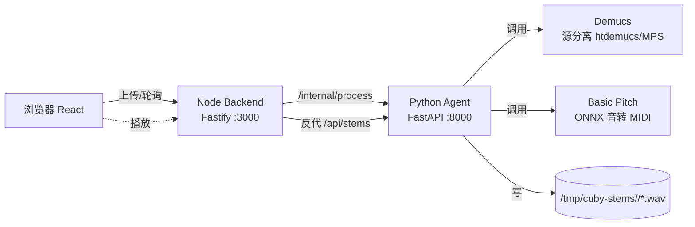
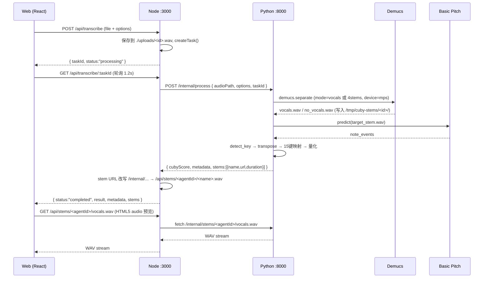
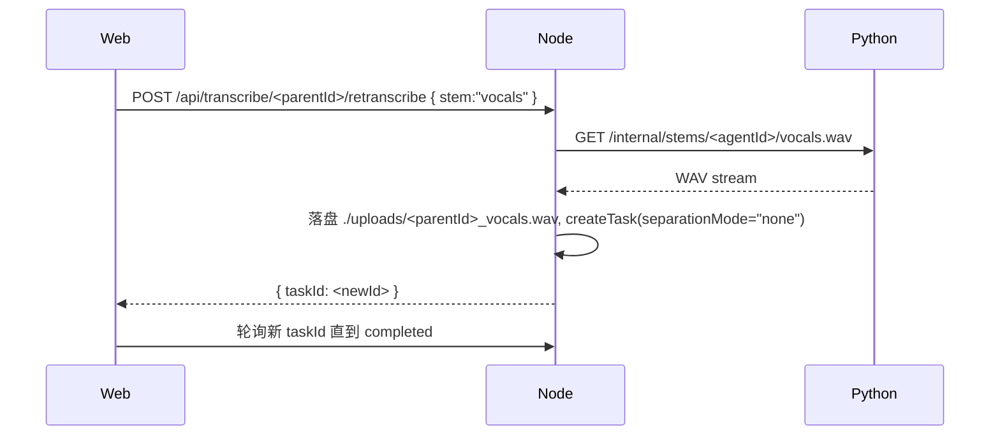
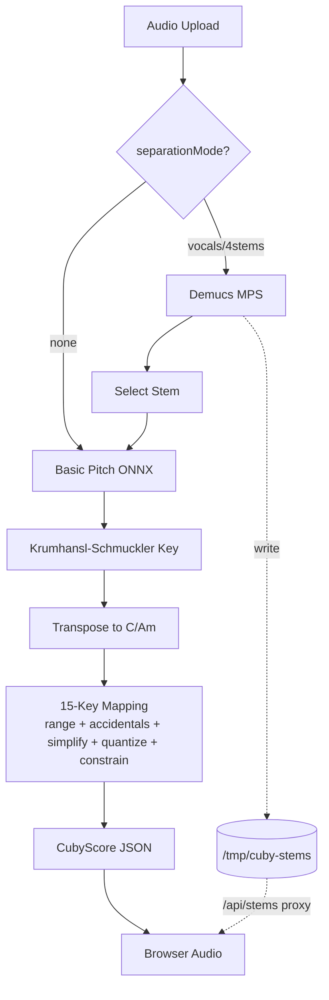

# Cuby Transcribe · 技术实现文档

> 自动音乐扒谱服务（面向《光遇 / Sky》15 键演奏）  
> 版本：当前 `main` 分支  
> 更新：2026-05-29

---

## 1. 目标与定位

- **输入**：用户上传一段音频（mp3 / wav / flac / m4a / ogg，≤ 50 MB）。
- **输出**：可在 Sky 15 键键盘上演奏的简化乐谱 **CubyScore**（自定义 JSON）。
- **可选**：先做**人声 / 乐器分离**（2 轨或 4 轨），再对其中任一条音轨扒谱。
- **非目标**：多声部 / 复杂和声 / 完整 MIDI（Sky 只有 15 个 C 大调白键）。

## 2. 顶层架构



| 层 | 进程 | 关键库 | 端口 |
|---|---|---|---|
| 前端 | Vite dev / Nginx prod | React 18, Tailwind v4, Zustand, lucide-react | 5173 → 80 |
| Node 后端 | Node 22 + tsx watch | Fastify 5, @fastify/multipart, axios | 3000 |
| Python Agent | uvicorn | FastAPI, Basic Pitch (ONNX), Demucs (PyTorch MPS), librosa, loguru | 8000 |
| 共享存储 | 本地 FS | `./uploads/`、`/tmp/cuby-stems/<taskId>/` | — |

设计要点：
1. **三段式无状态**：前端只持 token (taskId)；状态全在 Node 内存 Map；Python 完全纯函数。
2. **同 ID 贯穿**：Node 把 `taskId` 传给 Python，Python 也用它作为 stems 目录名 → 前后端 URL 可重建，不需额外映射表。
3. **HTTP 代理而非共享卷**：Node 用 `fetch(PYTHON_AGENT_URL/internal/stems/...)` 拉 stem 再下发给浏览器；本地开发与 docker-compose 都一套代码。

## 3. 完整数据流

### 3.1 首次上传（含分离）



### 3.2 切换 stem 重新扒谱（复用分离结果）



> 关键：第二次任务 `separationMode="none"`，跳过 Demucs，只走 Basic Pitch + 后处理，**秒级返回**。

## 4. Python Agent · 流水线

### 4.1 模块树
```
python-agent/app/
├─ main.py                  # FastAPI 路由
├─ models.py                # Pydantic 契约
└─ pipeline/
   ├─ processor.py          # 总调度
   ├─ separator.py          # Demucs 封装 + 重试
   ├─ transcriber.py        # Basic Pitch（复音）封装
   ├─ melody_extractor.py   # PYIN 单音旋律提取（人声主旋律首选）
   ├─ key_detector.py       # Krumhansl-Schmuckler 调性检测
   ├─ key_optimizer.py      # 最佳可弹奏调搜索（输出推荐升降调键）
   └─ sky_mapper.py         # 15 键映射 + 量化
```

### 4.2 关键阶段（[processor.py](../python-agent/app/pipeline/processor.py)）

| 阶段 | 输入 | 输出 | 备注 |
|---|---|---|---|
| 1. Demucs 分离 *(可选)* | 原音频路径 | `{stem_name: wav_path}` | 仅当 `separationMode != "none"` |
| 2a. PYIN 单音旋律 *(可选)* | vocals.wav | `[{pitch,start,end,velocity}]` | 当 `melodyMode=vocal` 且目标 stem 为 `vocals` |
| 2b. Basic Pitch 复音转录 | 选定的 stem 路径 | 同上 | 兜底；适合纯器乐 stem |
| 3. 调性检测 | notes | `{key, mode, confidence, transposeToC}` | Krumhansl-Schmuckler |
| 4a. 最佳可弹奏调 *(可选)* | notes | shift ∈ [-6, +5] | 输出 `recommendedShift`、`playableKey` |
| 4b. 转 C/Am *(可选)* | notes | 移调后 notes | 与 4a 互斥；4a 优先 |
| 5. 15 键映射 | notes | 落在 15 键集合内的 notes | adapt_range → resolve_accidentals → simplify → quantize → constrain |
| 6. 打包 | — | `CubyScore` + `Metadata` | 含 `transcribedStem` / `melodyAlgo` / `recommendedShift` |

### 4.3 旋律提取：双算法

| 算法 | 何时启用 | 适用 | 特点 |
|---|---|---|---|
| **Basic Pitch (ONNX)** | `melodyMode=auto`（默认） | 整曲 / 纯器乐 stem | 复音；快；但人声泛音+残余伴奏易碎 |
| **PYIN (librosa)** | `melodyMode=vocal` 且 `transcribeStem=vocals` | 人声主旋律 | 帧级 F0 → 段聚合；天然单音；零额外依赖 |

PYIN 默认参数（[melody_extractor.py](../python-agent/app/pipeline/melody_extractor.py)）：
- `fmin=65Hz` (C2)，`fmax=1200Hz` (D6)，覆盖男低 ~ 女高
- `hop_length=256 @22050Hz` → 约 11.6 ms / 帧
- `voiced_prob ≥ 0.55` 才计入；段内允许 ±0.5 半音漂移
- 段时长 < 100 ms 视作装饰丢弃；80 ms 内同音自动合并

### 4.4 最佳可弹奏调（[key_optimizer.py](../python-agent/app/pipeline/key_optimizer.py)）

对每个候选 `shift ∈ [-6, +5]` 半音打分：

```
score = 1.0 * 白键命中率(时长加权)
      + 0.6 * 折叠前已在 [C4,C6] 的比例
      - 0.3 * 折叠后音高跨度 / 24
```

取最高分作为推荐。元数据返回：
- `recommendedShift`：玩家在 Sky 内按下的升降调键半音数（正=升）
- `playableKey`：对应的"手感调"展示（C / D / Eb …）

> 与 `transposeToC` 互斥：若同时开启，**`optimizePlayKey` 优先**。

### 4.5 Demucs 模块（[separator.py](../python-agent/app/pipeline/separator.py)）

- **模型**：`htdemucs`（Hybrid Transformer Demucs，~80 MB；MDX 2023 SOTA 之一）
- **设备**：自动 MPS（Apple Silicon）→ CUDA → CPU
- **两种模式**：
  - `vocals`：`--two-stems=vocals` → `vocals.wav`、`no_vocals.wav`
  - `4stems`：默认输出 → `vocals / drums / bass / other`
- **健壮性**：
  - `_prefetch_model()` 在调用 demucs CLI 前先用 `torch.hub` 预拉权重；遇到 hash 不匹配（CDN 抖动）**最多重试 3 次**，并清理 `.tmp` / 零字节残留。
  - 可通过 `DEMUCS_MODEL=mdx_extra_q`（需 `diffq`，更小但单文件）切换轻量模型。
- **输出落盘**：`/tmp/cuby-stems/<taskId>/<stem>.wav`（path 由 `STEMS_DIR` 覆盖）。

### 4.6 Basic Pitch 模块（[transcriber.py](../python-agent/app/pipeline/transcriber.py)）

- 优先加载 ONNX → CoreML → TFLite。
- 输出 `note_events: [(start, end, pitch, velocity, pitch_bends), ...]`。
- velocity 兼容 0–1 与 0–127 两种返回。
- BPM 用 `librosa.beat.beat_track`（PLP 算法）。

### 4.7 调性检测（[key_detector.py](../python-agent/app/pipeline/key_detector.py)）

经典 **Krumhansl-Schmuckler**：
1. 把音符按时长加权累积成 12 维音高直方图；
2. 与 24 个旋转后的大/小调 profile 做 Pearson 相关；
3. 取最高分对应的调性；
4. `transposeToC` = 把主音移到 C(0)/A(9) 的最短半音数（−6..+6）。

### 4.8 15 键映射（[sky_mapper.py](../python-agent/app/pipeline/sky_mapper.py)）

Sky 15 键 = C4–C6 的两个八度的白键：

```python
SKY_KEYS = [60, 62, 64, 65, 67, 69, 71, 72, 74, 76, 77, 79, 81, 83, 84]
```

处理链：

| 子步骤 | 作用 |
|---|---|
| `adapt_range` | 平均音高居中到 72（中间 C 上方），其余按八度折叠到 [60,84] |
| `resolve_accidentals` | 变化音根据前后旋律方向就近匹配到 C 大调自然音 |
| `simplify_melody` | 丢弃 <120 ms 装饰音 + 合并 50 ms 内同音 |
| `quantize_rhythm` | 按 BPM 量化到 1/8 或 1/16 网格 |
| `constrain_to_sky` | 兜底：任何不在 15 键集合的音 → 最近邻 |

## 5. 接口契约

### 5.1 Web ⇄ Node (`/api/*`)

| 方法 | 路径 | 说明 |
|---|---|---|
| POST | `/api/transcribe` | multipart：`file` + `options` (JSON) |
| GET | `/api/transcribe/:taskId` | 状态 + 结果 + stems[] |
| POST | `/api/transcribe/:taskId/retranscribe` | body `{stem}` → 用已分离 stem 重扒 |
| GET | `/api/stems/:agentId/:name` | 代理 stem 文件下载 / `<audio>` 播放 |

请求 `options`（[types.ts](../web/src/types.ts)）：
```jsonc
{
  "transposeToC":    true,         // 是否转 C/Am（与 optimizePlayKey 互斥）
  "simplifyMelody":  true,         // 是否做装饰音过滤
  "quantizeGrid":    16,           // 量化网格 8 或 16
  "separationMode":  "vocals",     // "none" | "vocals" | "4stems" | "6stems"
  "transcribeStem":  "no_vocals",  // 可选；不传时取该模式默认 stem
  "melodyMode":      "auto",       // "auto" Basic Pitch | "vocal" PYIN（仅 vocals 生效）
  "optimizePlayKey": true,         // 枚举最佳可弹奏调，输出推荐升降调键

  // v2 复音 / 和弦感知（一键预设默认 polyphonic）
  "arrangementMode":  "polyphonic",// "polyphonic" 保留和弦 | "monophonic" 仅主旋律
  "maxSimultaneous":  4,           // 同时按下的最大键数（受 15 键玩家手指数约束，2-6）
  "detectChords":     true,        // 是否做和弦识别（chroma + Viterbi）
  "forceMonophonic":  false        // 兼容旧字段；为 true 时强制单音骨架
}
```

响应（completed）：
```jsonc
{
  "taskId": "abc...",
  "status": "completed",
  "progress": 100,
  "metadata": {
    "detectedKey": "D", "detectedMode": "major",
    "bpm": 117.45, "duration": 60.0,
    "noteCount": 112, "elapsed": 2.14,
    "transcribedStem": "vocals",
    "melodyAlgo": "pyin",
    "recommendedShift": 2,        // 玄戏内升降调键调 +2
    "playableKey": "D",
    "arrangementMode": "polyphonic",
    "maxConcurrent": 4,           // 实际同帧并发上限（reducer 输出）
    "chords": [                   // detectChords=true 时返回，按时间升序
      { "start": 0.66, "end": 2.86, "label": "Am", "root": 9, "quality": "min" },
      { "start": 2.86, "end": 4.30, "label": "F",  "root": 5, "quality": "maj" }
    ]
  },
  "stems": [
    { "name": "vocals",    "url": "/api/stems/abc.../vocals.wav",    "duration": 60.0 },
    { "name": "no_vocals", "url": "/api/stems/abc.../no_vocals.wav", "duration": 60.0 }
  ],
  "result": { /* CubyScore */ }
}
```

### 5.2 Node ⇄ Python (`/internal/*`)

| 方法 | 路径 | 说明 |
|---|---|---|
| POST | `/internal/process` | body `{audioPath, options, taskId}` |
| GET | `/internal/stems/:taskId/:name` | 返回 wav（含路径穿越防护） |

### 5.3 CubyScore JSON Schema（[v1.1](../python-agent/app/models.py)）

```jsonc
{
  "version": "1.1",
  "meta": {
    "title": "...", "composer": "AI Transcribed",
    "bpm": 117.45, "timeSignature": "4/4",
    "keySignature": "C", "ppq": 480
  },
  "tracks": [{
    "id": "track_1",
    "name": "Melody",
    "instrument": "sky_15",
    "notes": [{ "pitch": 60, "time": 0.0, "duration": 0.25, "velocity": 90 }]
  }]
}
```

## 6. 前端

### 6.1 模块树
```
web/src/
├─ App.tsx               # 三栏布局
├─ main.tsx, index.css   # Tailwind v4 入口
├─ api.ts                # fetch wrappers
├─ store.ts              # Zustand：file/options/task/stems/score
├─ types.ts              # API 契约
├─ stems.ts              # 单源 STEM_REGISTRY + STEMS_BY_MODE
└─ components/
   ├─ Uploader.tsx       # 拖拽 + 分离面板 + 选项
   ├─ ProgressCard.tsx   # 进度卡
   ├─ AudioPlayer.tsx    # 原音播放
   ├─ StemsPanel.tsx     # 多 stem 播放/下载/切扒谱
   ├─ ScoreViewer.tsx    # Tab: Sky/Roll/Stems/JSON
   ├─ Sky15Keys.tsx      # 15 键键盘可视化
   └─ PianoRoll.tsx      # SVG 钢琴卷帘
```

### 6.2 状态机（zustand store）
- `file/audioUrl` → 选定文件后的 `URL.createObjectURL`，重选时 revoke。
- `options` → 上传选项。
- `task` → `{status, progress, message, error}` 实时更新。
- `parentTaskId` → 首次任务 id，重扒谱用它索引共享 stems。
- `score/meta/stems` → 完成后的产物。
- `startUpload()` / `retranscribeWith(stem)` 内部用 `pollUntilDone()`（1.2 s 轮询）。

### 6.3 stem 单源派生（去冗余的一处典型）
- 之前 `Uploader` 和 `StemsPanel` 各维护一份 stem 元信息表。
- 现在统一到 [stems.ts](../web/src/stems.ts) 的 `STEM_REGISTRY`（`as const`），`StemName` 类型从其 key 派生，`STEMS_BY_MODE` 列出每种分离模式下应展示的 stems。两个组件都从这里取数据。

## 7. 性能基准

**测试环境**：M 系列 Mac，Python 3.9 + onnxruntime CPU，Apple Silicon MPS（Demucs）。

| 音频时长 | Basic Pitch 耗时 | RTF | 备注 |
|---:|---:|---:|---|
| 5 s | 2.93 s | 0.587 | 首次冷启动含模型 load |
| 10 s | 0.53 s | 0.053 | 暖运行 |
| 30 s | 2.01 s | 0.067 | |
| 60 s | 2.14 s | 0.036 | |

`vocals` 分离 + 扒谱（同 60 s 量级音频）：~13 s（含 Demucs 在 MPS 上的推理）。  
基准脚本：[benchmarks/run_bench.py](../benchmarks/run_bench.py)。

## 8. 部署

### 8.1 本地开发
```bash
# python
cd python-agent && python3 -m venv .venv && source .venv/bin/activate
pip install -r requirements.txt
uvicorn app.main:app --port 8000

# node
cd node-backend && npm i && npm run dev          # :3000

# web
cd web && npm i && npm run dev                   # :5173 (proxy /api → :3000)
```

### 8.2 Docker
- 三个 service：`python-agent`、`node-backend`、`web`（Nginx 反代 + 静态托管）
- [docker-compose.yml](../docker-compose.yml) 通过 `PYTHON_AGENT_URL=http://python-agent:8000` 连通
- 共享 stem 不靠 volume：Node 通过 HTTP 代理获取，简化部署

### 8.3 环境变量

| 变量 | 默认 | 作用 |
|---|---|---|
| `PORT` (node) | 3000 | 监听端口 |
| `UPLOAD_DIR` | `./uploads` | 用户上传保存目录 |
| `MAX_FILE_SIZE` | 50 MB | multipart 上限 |
| `PYTHON_AGENT_URL` | http://localhost:8000 | Python agent 地址 |
| `STEMS_DIR` (py) | `/tmp/cuby-stems` | 分离结果根目录 |
| `DEMUCS_MODEL` | `htdemucs` | 可换 `mdx_extra_q` 等 |
| `DEMUCS_RETRIES` | 3 | 模型下载最大重试 |

## 9. 安全 / 边界

- **multipart 上限** 50 MB（Fastify 配置）。
- **路径穿越防护**：`/internal/stems/:taskId/:name` 与 `/api/stems/:agentId/:name` 都拒绝 `..` / `/`。
- **CORS**：开发期 `*`，生产建议收口到域名。
- 当前**无鉴权**（任务 id 是随机 16 位）；多租户场景需加 token。

## 10. 已知限制与后续方向

| 限制 | 影响 | 后续 |
|---|---|---|
| 单实例内存队列 | 重启丢任务 | 接 Redis / SQLite |
| Basic Pitch 单声部偏好 | 复杂复调召回低 | 多模型集成 + 后处理切轨 |
| Demucs 首次需下 ~80 MB | 冷启动慢 | 镜像预烘焙模型，或共享 `~/.cache/torch` volume |
| 跨语言枚举重复（SKY_KEYS / SeparationMode） | 维护风险 | 引入 OpenAPI 代码生成 |
| 未实现 WS 进度推流 | 客户端只能轮询 | Fastify-websocket + 进度回调 |
| 调性置信度未暴露给用户 | 误判时无线索 | 在 UI Metadata 区展示 |

## 11. 一图总结



---
*Maintainer: cuby team · 详细变更见 git log*
